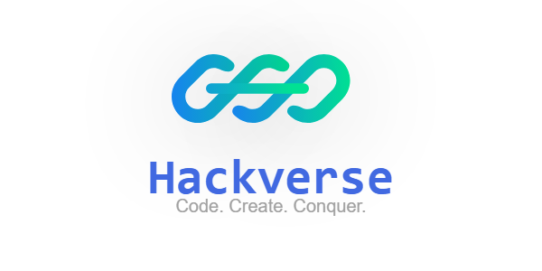

# HackVerse - Modern Hackathon Management Platform



> Empowering innovation through collaborative hackathons

## 🚀 Overview

HackVerse is a comprehensive platform for managing hackathons, streamlining every stage from event creation and registration to team formation, project submission, and judging. It delivers a seamless experience for both organizers and participants.

## ✨ Features

### For Organizers

- **Hackathon Creation:** Set up and customize events easily
- **Participant Management:** Track registrations and teams
- **Dashboard Analytics:** Real-time insights on participation and submissions
- **Judging System:** Simplified evaluation of projects
- **Success Metrics:** Monitor submissions, completions, and engagement

### For Participants

- **Event Discovery:** Find hackathons by interest
- **Team Formation:** Create or join teams
- **Skill Showcasing:** Highlight skills and find teammates
- **Project Submission:** Submit projects with GitHub links and demos
- **Real-time Notifications:** Stay updated on requests and deadlines

### Platform Features

- **Responsive Design:** Works on desktop and mobile
- **Real-time Updates:** Live notifications and sync
- **User Profiles:** Skills, portfolios, and history
- **API Integration:** Connect with GitHub and other platforms

## 🛠️ Technology Stack

### Frontend

- **Framework:** Next.js (React 18)
- **Styling:** Tailwind CSS, custom design system
- **State Management:** Redux Toolkit, RTK Query
- **UI Components:** Shadcn UI, custom theme
- **Animations:** Framer Motion
- **Forms:** React Hook Form, Zod validation

### Backend

- **API:** RESTful, Node.js
- **Database:** PostgreSQL, Prisma ORM
- **Authentication:** JWT-based, secure sessions
- **File Storage:** Cloud storage for assets

## 📋 Prerequisites

- Node.js (v16+)
- npm or yarn
- PostgreSQL

## 🔧 Installation

1. **Clone the repository:**
   ```bash
   git clone https://github.com/adithya-adee/hackverse.git
   cd hackverse
   ```
2. **Install dependencies:**
   ```bash
   npm install
   # or
   pnpm install
   ```
3. **Set up environment variables:**  
   Create a `.env.local` file in the root directory with your configuration.

4. **Set up the database:**  
   Configure PostgreSQL and run migrations as needed.

5. **Start the development server:**
   ```bash
   npm run dev
   # or
   pnpm run dev
   ```

## 🏗️ Project Structure

- `frontend/` – Next.js app
- `backend/` – Node.js API
- `prisma/` – Database schema and migrations

## 📱 Usage

### Organizer Flow

1. Create an account and log in
2. Request Organizer Role from dashboard
3. Set up a new hackathon (details, timeline, rules)
4. Monitor registrations and teams
5. Review and judge submissions
6. Announce winners and distribute prizes

### Participant Flow

1. Create an account with skills/interests
2. Browse hackathons
3. Register for events
4. Create or join a team
5. Collaborate and submit projects
6. Receive feedback and results

## Endpoints

**Key endpoints:**

- `/api/auth` - Authentication handling
- `/api/hackathons` – Manage hackathons
- `/api/users` – User profiles
- `/api/teams` – Team management
- `/api/submissions` – Project submissions
<!-- - `/api/judging` – Evaluation and feedback -->

## 🤝 Contributing

Contributions are welcome!

1. Fork the repo
2. Create a feature branch:  
   `git checkout -b feature/amazing-feature`
3. Commit your changes:  
   `git commit -m 'Add some amazing feature'`
4. Push to your branch:  
   `git push origin feature/amazing-feature`
5. Open a Pull Request

See our Contributing Guidelines for more details.

## 📄 License

MIT License – see the LICENSE file.

## 📞 Contact

Project Link: [https://github.com/adithya-adee/hackverse](https://github.com/adithya-adee/hackverse)

## 🙏 Acknowledgements

- React
- Next.js
- Tailwind CSS
- Shadcn UI
- Lucide Icons
- Prisma
- All our amazing contributors!
